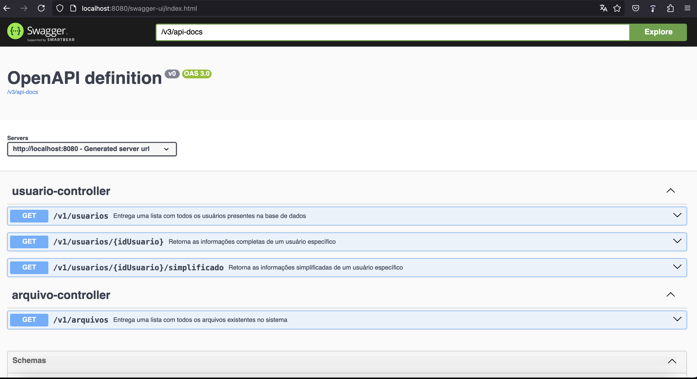

# Contexto da demanda
Você é um engenheiro de software que atua diariamente alocado em uma squad com outros 3 engenheiros, seguindo as priorizações 
realizadas pelo time de negócio (representadas dentro da squad pelo papel de um PM). Um de seus colegas engenheiro, puxou um ticket priorizado
e conseguiu finalizar a implementação em uma sexta-feira antes de iniciar seu período de férias. O colega em questão finalizou o código, 
realizou o deploy em ambiente de homologação, fez algumas validações rápidas e deixou a seguinte mensagem no canal de comunicação da equipe:

"Time, finalizei a implementação do ticket. Foi na correria, mas deu tudo certo. Subi a API em homologação para que o time de qualidade
possa iniciar os testes na próxima semana. Conforme falamos, estou saindo de férias e retorno somente daqui a 30 dias.
Conto com vocês para darem seguimento na demanda e disponibilizarem a feature em produção. Nos vemos no próximo mês, até logo!"

Na segunda-feira da semana seguinte, o time de qualidade inicia os testes e todos os comportamentos testados nos primeiros dias se mostram dentro do esperado.
Na quarta-feira, quando a demanda já está quase na etapa de finalização dos testes e a expectativa do time de negócio está alta para 
liberar a funcionalidade em ambiente produtivo, surge um ticket de bug no board da equipe, vinculado a demanda em questão.

A sua tarefa é descobrir e resolver este bug. Você deve fazer isso respeitando as orientações do ticket da demanda e os acordos do time, mesmo diante da pressão pela entrega.

## Acordos do Time
1. Prezamos por um ambiente colaborativo. Nos ajudamos e nos fortalecemos em momentos de dificuldade, sem realizar apontamento de dedos para nossos colegas.
2. Prezamos pela qualidade das entregas na engenharia de software. Mesmo em momentos de pressão, a qualidade da entrega em sua totalidade deve ser priorizada.
3. Entregamos o código sempre melhor do que o recebemos. Não nos limitamos ao escopo da alteração.

## Contexto da aplicação
API desenvolvida, realiza uma consulta de usuários e também de seus arquivos. Buscando isso, foi implementada uma aplicação em Java, utilizando o Spring Boot e H2 como banco de dados. 

### Operações:

1. Listar todos os usuários da base de dados.
2. Detalhar todas as informações de um usuário específico.
3. Retornar os dados de um usuário específico, porém de forma simplificada (Apenas nome e email).
4. Retornar todos os arquivos do sistema, porém sem seu respectivo conteúdo. Neste mesmo endpoint, caso seja informado um usuário específico, deve-se retornar todos os arquivos do usuário, com o conteúdo dos arquivos incluso.

## Documentação

Para fins de facilitar o teste da  aplicação foi adicionado uma documentação em swagger (https://swagger.io) que está acessível em: http://localhost:8080/swagger-ui/index.html




### Estrutura de diretórios

- <b>configuration</b>: Namespace relativo a arquivos de <b>configurações</b> da aplicação. Atualmente nele encontramos a configuração do CacheManager (https://docs.spring.io/spring-boot/reference/io/caching.html)
- <b>controller</b>: Namespace relativo a arquivos de <b>controladores</b> da aplicação, ou seja, a interface de entrada da aplicação.
- <b>dto</b>: Namespace relativo a arquivos de <b>*data transform object*</b> (https://www.devmedia.com.br/diferenca-entre-os-patterns-po-pojo-bo-dto-e-vo/28162) da aplicação.
- <b>entity</b>: Namespace relativo a arquivos de <b>entidades</b> de mapeamento de dados que serão manipulados.
- <b>repository</b>: Namespace relativo a arquivos de <b>repositórios</b>, acessando diretamente o banco de dados e permitindo realizar operações CRUD (https://developer.mozilla.org/pt-BR/docs/Glossary/CRUD).
- <b>service</b>: Namespace relativo a arquivos de <b>serviços</b>, ou seja, nestes arquivos possuíamos a regra de negócio implementada.
- <b>enumeration</b>: Namespace relativo a arquivos de <b>enumerações</b> (https://www.devmedia.com.br/tipos-enum-no-java/25729) .

## Executar a Aplicação
### Gradle

Para executar a aplicação, utilizando o Gradle, executar os comandos abaixo na raíz do projeto:

```bash
#compilação 1
gradle build 
```
```bash

#compilação alternativa
./gradlew build
```
### Docker Compose

Para executar a aplicação, usando o Docker, na raíz do projeto executar os comandos abaixo:


```bash
#compilação
docker-compose up
```

## Executar testes na Aplicação
### Gradle

```bash
#alternativa 1
gradle test 
```

```bash
#alternativa 2
./gradlew test 
```